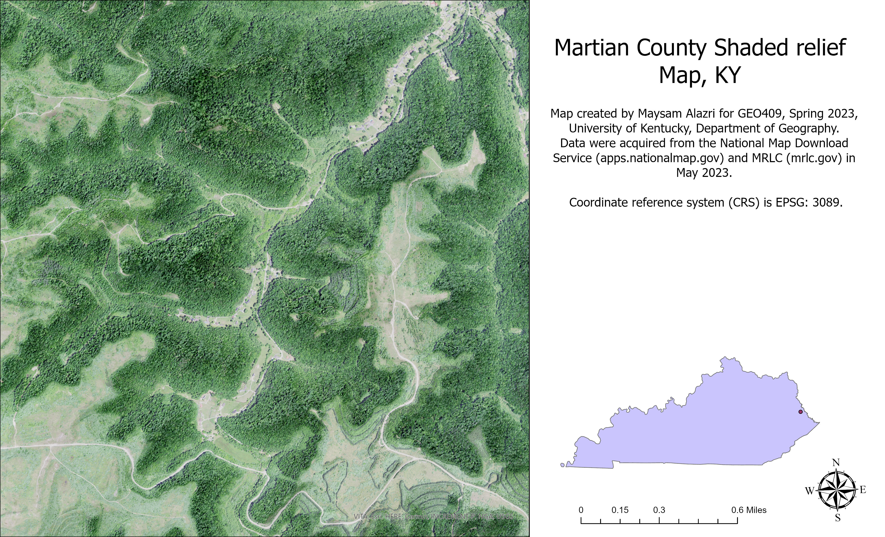
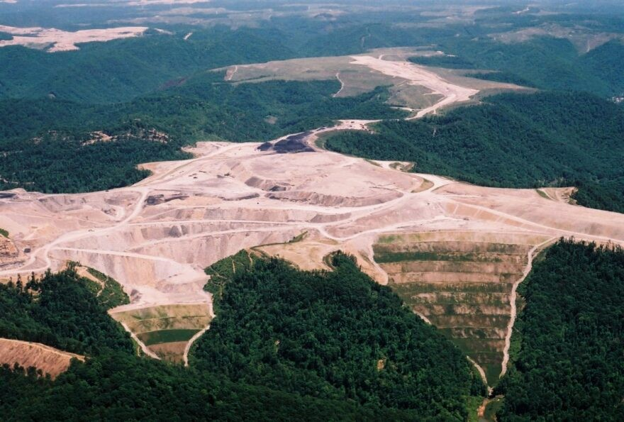

# LAB-07-SHADED-RELIEFS-MAP
Coal mining has been a major economic driver in the state of Kentucky for many years, providing jobs and income to communities throughout the region. However, this industry also has significant environmental and social impacts, particularly on the areas where mining takes place. For example, the Appalachian Mountains in eastern Kentucky have been heavily mined for coal, leading to deforestation, soil erosion, and water pollution. These effects can have far-reaching consequences, including damage to local ecosystems and impacts on public health. Additionally, the decline of the coal industry in recent years has led to economic challenges for many communities in Kentucky, highlighting the need for diversified economic development strategies.
However, this page foucused on Martin County in the State of Kentucky which is of the places that got affected by this process. 
Maps for one of the places in Martin County shows how the southewestren side of the mao eroded. 

           – [Download geospatial PDF](shaded-relief.pdf)

From the picture shown above we can clearly see how the top part of the mountian got removed.  
visit this website for more information about this problem in westren Kentucky. 
(https://www.wkyufm.org/environment/2019-11-22/appalachias-strip-mined-mountains-face-a-growing-climate-risk-flooding)

Maps created by Maysam Alazri for GEO409, Spring 2023, University of Kentucky Department of Geography